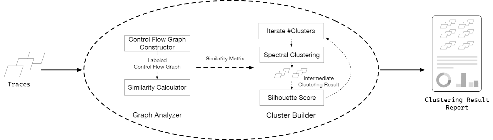

# TraceClusterMaker

`TraceClusterMaker` is a refactoring and enhancement of `cluster_utils` and the latter has been deprecated now. We make it more user-friendly oriented, add some new features, and decouple it for easier future extension.

## Overview



This tool enumerate all files from the given *root directory* and treat them all as traces. A *trace* file is a **UTF-8** encoded multi-line plain-text file with any legal file name, in which each line has a hexadecimal address value prefixed with *0x*. In addition, line breaks are compatible across platforms. You can browse `trace_file_example.txt` to understand this file structure.

If you have ground-truth class info about each trace for evaluation, we highly recommend that you attach these class tags to the trace-file-path in a pattern that single regex expression can match, so that  values for some metrics, such as *purity* and *F1-measure*, will be automatically calculated and written to the report. For example, place some corresponding traces in directory `CVE-1234-12345` and `CVE-5678-67890`. Then place the two folders in a so-called *root directory* `all_traces`. Set parameter `--benchmark` with `CVE-\d{4}-\d{5}` additionally and run, you will get a report contains some useful scores.

The traces found would be read and analysed one by one. Finally a report file with *JSON* format would be saved in the destination folder you specified.

⚠️**CAUTION** 

- According to [paper](https://hexhive.epfl.ch/publications/files/21CCS.pdf) of Igor: *there is a heuristic to decide if we need to repeat clustering based on the number of full-length crash call stacks: for less than 20 call stacks, running the clustering process once suffices, while for more than 20 call stacks, we cluster twice.* 

- You probably need to parse the report, place the traces into different folders by cluster, and then decide whether to repeat clustering. Otherwise, if you run only once, the report may not contain good results you expect.

- In our latest research, we have designed a new improvement scheme, which can effectively replace this fussy heuristic in some cases. We plan to merge the code into current branch in the future.

## Components

### ✅ `DCFG.py`: Traces to DCFGs

According to [DCFG by Intel](https://www.intel.com/content/www/us/en/developer/articles/technical/pintool-dcfg.html), strictly speaking, the Graph we build from trace is a *Dynamic Control-Flow Graph*, which is a specialized *CFG* that adds data from a specific execution of a program. We can use [NetworkX](https://networkx.org/documentation/stable/reference/introduction.html), [igraph](https://igraph.org/python/api/latest/), or [graphviz](https://graphviz.readthedocs.io/en/stable/api.html#api-reference) to describe this directed graph in python, and which package to use depends on the requirements of *Graph Kernel* package and rendering performance.

Class `DCFG` is base class which implements some common methods for parsing a trace file. Regardless of how the specific graph package uniquely identifies each node internally, we use integers which are decimal conversion of hexadecimal address in the trace to do this. The finally built Graph object will be stored in its attribute `DCFG_RAW`.

Classes that implement concrete DCFG-build-methods inherits `DCFG`. Each of them has methods `construct_dcfg` and `return_dcfg`. After creating an instance of `DCFG`, call `construct_dcfg` first to build and then call `return_dcfg` to receive the graph object.

### ✅ `GKA.py`: DCFGs to Similarity Matrix

`GKA` means *Graph Kernel Algorithm*, which can be intuitively understood as functions measuring the similarity of pairs of graphs. You can read [his papers](https://bsse.ethz.ch/mlcb/karsten/profile-karsten.html) for more details about the properties of different kernels and how to choose one according to your needs. 

Currently we use [GraKeL](https://ysig.github.io/GraKeL/0.1a8/index.html) to calculate graph similarity. Base class `GKA` and its inherited class `GKA_GraKeL` implement this. You create an instance of `GKA_GraKeL`, call its method `add_dcfg` on each of the DCFG items, then call method `apply_<Kernel Name>_Kernel`, and finally call `get_matrix` to receive the Similarity Matrix.

### ✅ `cluster.py`: Similarity Matrix to Cluster-ID list & Scores

We implement the classes for removing outliers, clustering and the methods about calculating some evaluation metrics, and use a list of strings to describe clustering results. 

It is currently built on [scikit-learn](http://scikit-learn.org/stable/) and you can view its usage in `ClusterMaker.py`.

### ✅ `ClusterMaker.py`: Wrapper, Reporter, and Scheduler 

The components above is for internal use and it is recommended not to use them before fully understanding the source code. 

`ClusterMaker.py` is the entrace of this tool. It takes command-line arguments and does all the relevant stuff for you.

We internally maintain an ordered list of absolute file path strings of all traces. Two ordered lists of Cluster-ID strings and Class-Tag strings (if they exist) are created with same correspondence with each trace. For example:

```python
trace_files  = ["/tmp/t/CVE-1234-12341_FNg", "/tmp/t/CVE-1234-12342_MUA"]
class_tags   = ["CVE-1234-12341", "CVE-1234-12342"]
cluster_tags = ["0", "1"]
```

> #### 👉 **Why do we need to detect outliers?**
> A small number of outliers will have an impact on the clustering results. And picking them out for special treatment rather than adding them to the clustering process does not have a decisive impact on crash deduplication.
> According to [this](https://scikit-learn.org/stable/modules/outlier_detection.html#isolation-forest), *one efficient way of performing outlier detection in high-dimensional datasets is to use random forests.* We apply `IsolationForest` from `sklearn` to do this.
> When the proportion of outliers is more or equal than `outlier_ratio`, we assert that all samples should be clustered.

> #### 👉 **How to understand a report?**
> The file name is defined by "report_" and a unix timestamp (ms) string.
> The file content is a JSON Object. It has 3 keys in toplevel: `Result`, `Score` and `Outlier`(if exists). Value of `Result` is a JSON Object contains `<Cluster-ID str>`/`<JSON Array of trace-file-path str>` pairs. Value of `Score` is a JSON Object contains `<metric name>`/`float value` pairs. Value of `Outlier` is a JSON Array contains the path of those outliers.
> We give an example of the report: `report_1655262593759_example.json`.

## Dependencies

This tool is written in *Python* and requires a minimum version of `3.6.9`. We highly recommend to use a virtual environment to install these dependencies via `pip`:

- `numpy (>= 1.19.5)`

- `matplotlib (>= 3.3.4)`

- `sklearn (>= 0.24.2)`

- `networkx (>= 2.5.1)`

- `grakel (>= 0.1.8)`
  
## Usage

```console
$ python3 ClusterMaker.py -i "<traces dir>" -o "<output reports dir>" --benchmark "<regex matching ground-truth class string>"  --outlier "<outlier ratio value>"
```
